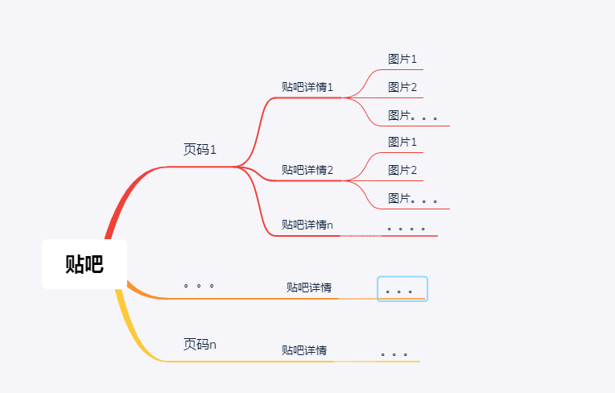
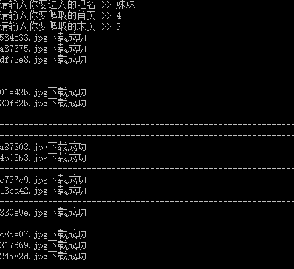
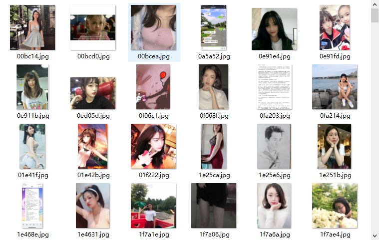

# 贴吧爬虫
爬取贴吧用户上传图片

## 1. python环境
1. python版本
	使用python3.6版本，3.6版本之前不支持 `f" { 变量 } "` 操作，请自行更改
2. 库
	以下为第三方库，请包装安装完毕，安装样例： ` pip3 install etree`
		etree
		requests


## 2. 思路以及一些设置
### 主要实现
1. 用户输入
	输入贴吧名字（结尾**不需要"吧"字**，除非是美女吧吧这种）--->输入起始页码--->输入结束页码（不可大于总页码）
	
2. 爬虫爬取路径

  首先进入某贴吧，可以看见贴吧目录大纲和底下页码，然后对页码进行循环操作，进入贴吧详情，对图片进行下载。

  

  

 


### 注意
1. 代码更新时间为2019-6-13，时间过久，请去我[github]()上查看最新的代码！

2. 本次实验的UA(user-agent)为IE7，尝试用谷歌的UA爬取失败。

3. 需要新建一个文件夹`img`作为图片路径，更改文件夹名称时，记得把代码路径更改。

4. **本代码并不是适用于所有贴吧**，因为每个贴吧的xpath路径有可能不同，若是要有自己想要爬取的贴吧，并且没有下载成功，请尝试跟新xpath路径，本次爬取贴吧的案例
	- 美女
	
5. **请正确输入吧名和数字**，本程序没有检查输入的情况请合理输入，由于是兴趣所致，程序健壮形不强

6. 记得加延时`time.sleep()`, 我在程序中设置了下载帖子详情页面就延时一秒钟，不然请求太频繁，容易被动断开链接，有可能被网站加入黑名单
## 3. 代码
```python
import requests
from lxml import etree
from time import sleep


class tieba():
        def __init__(self):
                self.headers = {"User-Agent":"Mozilla/4.0 (compatible; MSIE 7.0; Windows NT 6.0)"}
                self.url1 = "https://tieba.baidu.com/f?"
                self.url2 = "https://tieba.baidu.com"

        # 解析URL专用
        def parse_url(self,url):
                res = requests.get(url=url, headers=self.headers)
                return res

        # 负责解析网页，提取网页元素
        def load_page(self,text,xpath):
                html = etree.HTML(text)
                xpath_list = html.xpath(xpath)
                return xpath_list

        # 获取帖子内容的url列表，并调用函数保存
        def links_list(self, url):
                res = self.parse_url(url).text
                xpath = '//*[@id="thread_list"]/li[@class=" j_thread_list clearfix"]//a[@class="j_th_tit "]/@href'
                # 解析的是某吧的帖子详情页面
                links = self.load_page(res, xpath)
                l_list = []
                for i in links:
                        # 此路径拼接的是某吧的img图片页
                        link = self.url2 + i
                        l_list.append(link)

                # 对图片页面进行下载
                for link in l_list:
                        sleep(5)
                        self.img_write(link)


        # 解析图片地址，保存单个网页的图片文件
        def img_write(self, link):
                # 此xpath是查询某详情页面的img图片
                xpath = '//div[@class="l_post l_post_bright j_l_post clearfix  "]//img[@class="BDE_Image"]/@src'
                res = self.parse_url(link).text
                img_list = self.load_page(res, xpath)
                for i in img_list:
                        res = self.parse_url(i)
                        with open(f"./img/{i[-10:]}",'wb') as f:
                                f.write(res.content)
                                print(f'{i[-10:]}下载成功')

        # 主函数
        def main(self):
                name = input("输入你要进入的吧名(例如美女) >> ")
                start = input("请输入起始页码(0开始)>> ")
                end = input("请输入结束页码(一般为10页)>> ")
                # 输入格式化，
                if start.isdigit() and end.isdigit() and end>start:
                    for page in range(int(start),int(end)):
                            pn = (page-1) * 50
                            str1 = f'kw={name}&pn={pn}'
                            url = self.url1+str1
                            self.links_list(url)
                            print(f'页面{page}下载完成')
                else:
                    print("输入错误，请重新输入")
                    print("*"*60+"分隔符"+"*"*60+"\n")
                    return self.main()

if __name__ == '__main__':
        t = tieba()
        t.main()

```

## 结果
1、每一条线代表某一帖子的详情



2、文件夹内容


